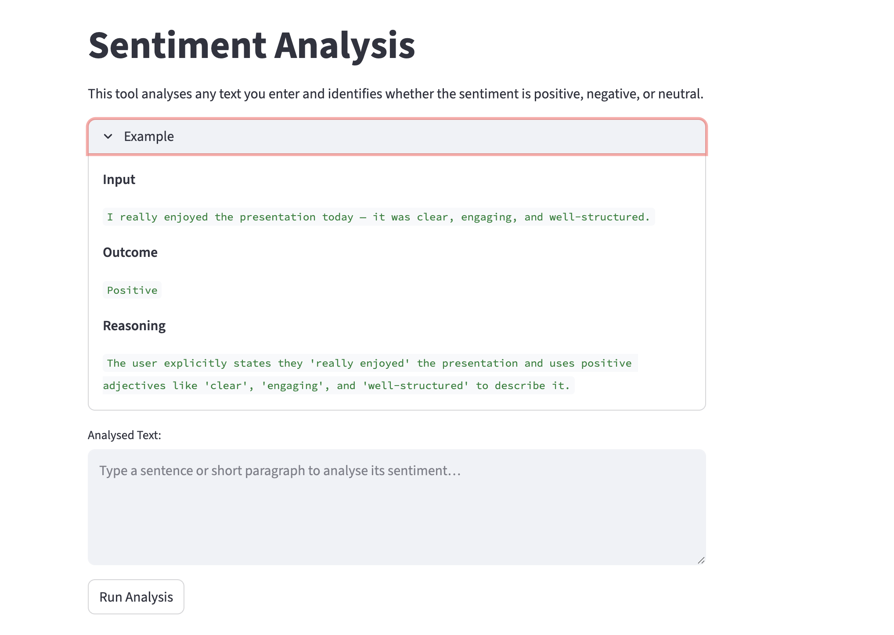

# Sentiment Analysis App (Streamlit + Gemini API)
A simple, cloud-ready sentiment analysis application built with Streamlit for the frontend and Google Gemini API for natural language processing.  
The project is containerised with Docker for easy deployment to services like Google Cloud Run.  

Designed as a fast prototyping exercise to explore and strengthen practical cloud engineering skills, including containerisation, serverless deployment, and integration of AI services in a production-like workflow.

## Features
- Simple text input with instant LLM generated sentiment (positive / negative / neutral) with reasoning
- Streamlit UI + Gemini API

## Tech Stack 
- Streamlit – Frontend UI

- Google Gemini API – LLM backend

- Docker – Containerisation

- Google Cloud
  - Cloud Run - Serverless deployment
  - Service Account -  Manages secure permissions between app and APIs
  - Artifact Registry - Stores and manages built Docker images

Snapshot

